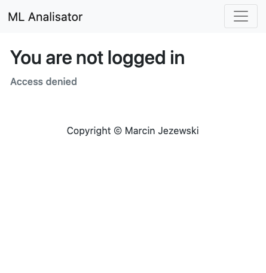

# Ml-Analisator

This project is a small application I did as a recruitment assignment. If you're interested in my findings from this project and more background, feel free to visit my blog.

## Features
- The application allows the user to upload their trained ML model from the scikit-learn framework, in the form of a Pickle file, a test data file and a training data file.
- The application generates a confusion matrix and statistics on the effectiveness of a given model.
- Each logged-in user has an exclusive list of reports, accessible only after login.
- The user can generate the report as a .pdf file and download it.

## Pictures
> Report screen


> Login screen


> Not logged in screen



> Upload screen
>


## Usage

I use pipenv to manage packages and the virtual environment. Make sure it is installed on your system before using it. 

# Clone the repository

```bash
git clone git@github.com:jezonek/ml-model-analisator.git
```

# Install all dependencies

```bash
cd ml-analisator

pipenv install 
```

# Run migrations on your local database

```bash
pipenv run python manage.py migrate --run-syncdb
```
# Create superuser (admin) account for your app

```bash
pipenv run python manage.py createsuperuser
```

# Run local server

```bash
pipenv run python manage.py runserver   
```

App should be available at [http://127.0.0.1:8000/](http://127.0.0.1:8000/)